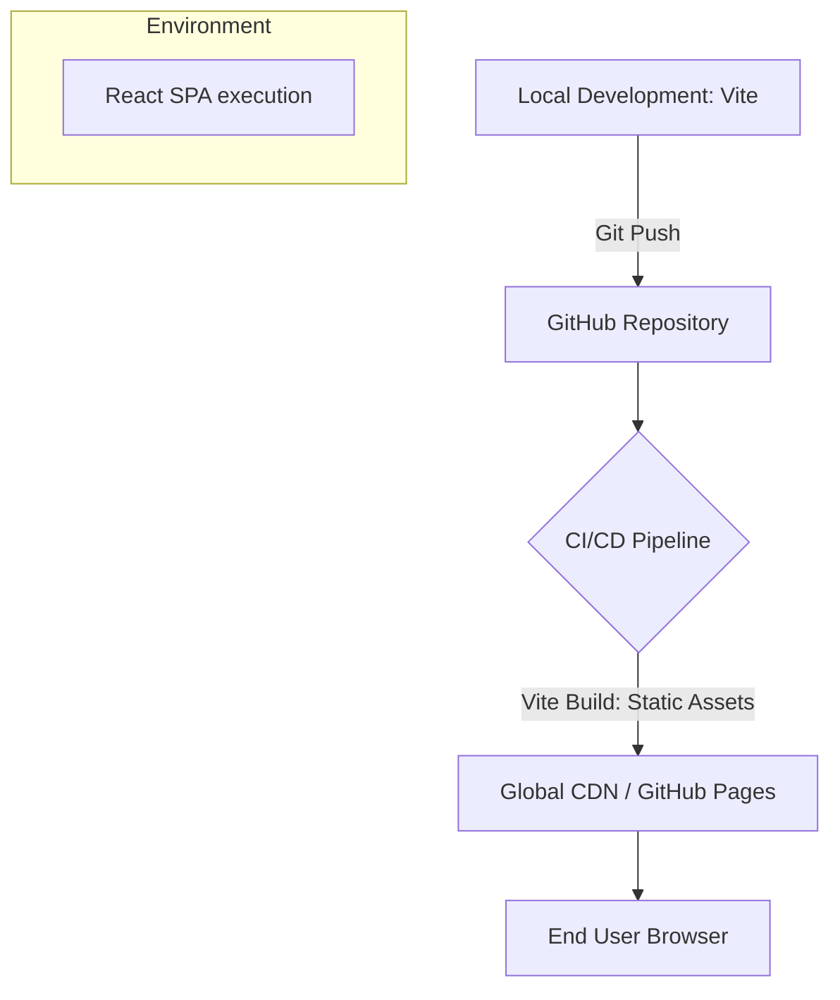

# Infrastructure Specification: agents.md

## 1. Project Overview
**Project Type:** Personal Website / Portfolio (Interactive Terminal)
**Core Framework:** React + Vite
**Primary Goal:** Showcase technical depth and creativity to recruiters, specifically targeting Waterloo CS co-op roles, via a "Hacker/Mathematical" minimalist terminal UI.

---

## 2. Framework Selection Matrix
The following frameworks were evaluated for this project:

| Framework | Status | Reason for Selection/Rejection |
| :--- | :--- | :--- |
| **React + Vite** | **Selected** | Extremely fast client-side rendering (SPA). Ideal for a highly interactive, state-driven "terminal" lacking traditional multiple pages. Lightweight and minimal boilerplate. |
| **Next.js** | Alternative | Best for SSR and traditional routing. Overkill for this specific single-screen terminal application where all rendering and interactivity relies on the client. |
| **Vanilla HTML/JS** | Alternative | Strong option for a pure hacker aesthetic, but utilizing React made building robust command history and user input state management significantly faster and easier to scale. |
| **Tailwind CSS** | Rejected | Aesthetically, this project demanded custom, bespoke animations (CRT scanlines, blinking block cursors). Pure Vanilla CSS was chosen for authenticity and precise low-level control of rendering details. |

---

## 3. Tech Stack & Styling Architecture
- **Language**: JavaScript (React JSX)
- **Tooling**: Vite (Development server & production bundler)
- **Styling**: Vanilla CSS (`index.css` & `App.css`) with CSS custom properties (`:root` variables) driving a highly specific, high-contrast dark mode color palette.
- **Typography**: Built specifically using Google Fonts' `Fira Code` for a true developer monospace look with programming ligatures.

---

## 4. Hosting & Deployment Strategy (Free Tiers)
Because Vite builds out to a completely static bundle (`index.html`, plus optimized JS/CSS assets), this interactive SPA can be hosted cheaply and efficiently almost anywhere.

### Option A: GitHub Pages (Recommended for Developers)
- **Role:** Primary Production Host.
- **Benefits:** Free, inextricably linked to the source-control repository (a good signal for recruiters exploring the github), simple setup via GitHub Actions.
- **Cost:** $0.

### Option B: Vercel / Netlify
- **Role:** Alternative Production Host.
- **Benefits:** Automated out-of-the-box CI/CD pipelines connected directly to the GitHub repo. Instantly builds a global CDN edge network deployment on push.
- **Cost:** $0 (Hobby).

---

## 5. Technical Architecture
